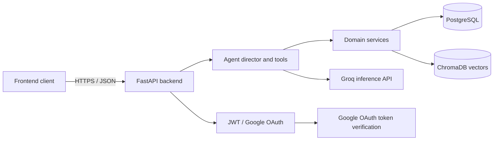
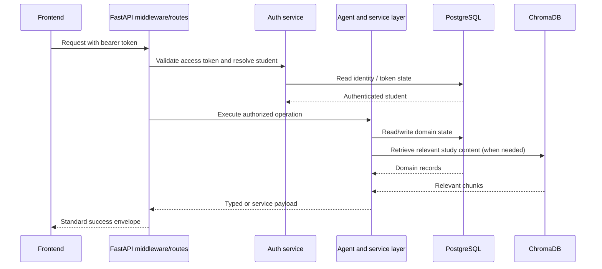
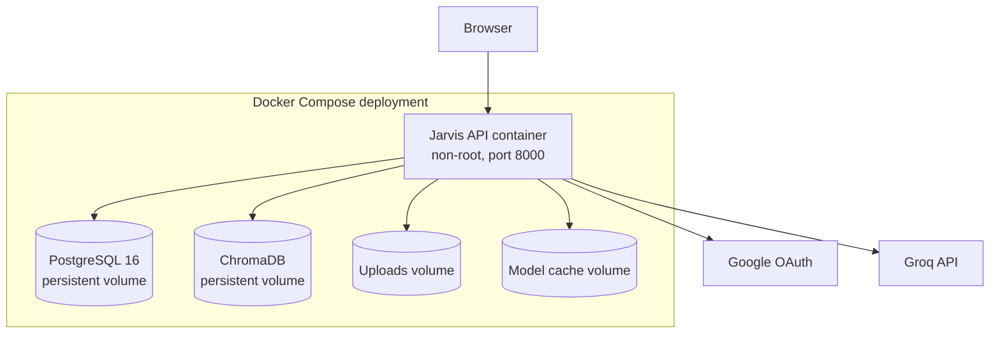

# System Architecture

## Components

- **FastAPI:** routing, request/response envelopes, CORS, rate limiting, request tracking, and OpenAPI.
- **Authentication:** Google OAuth ID-token validation issues JWT access/refresh tokens. Middleware validates bearer access tokens and places the authenticated student identity on the request.
- **PostgreSQL:** relational source of truth for accounts, academic records, study artifacts, plans, goals, chat, audit events, and job execution.
- **ChromaDB:** persistent vector collection used for study-material retrieval. Keyword/BM25 index data is synchronized from Chroma during application startup.
- **Agent layer:** the director coordinates specialized agents and registered tools through service modules.
- **Analytics layer:** analytics services and agents derive dashboards, readiness, topic mastery, recommendations, and learning insights from stored student activity.
- **Background jobs:** APScheduler runs registered reminder and analytics work and records executions in PostgreSQL.
- **External services:** Groq provides model inference; Google validates OAuth identity tokens.

## Context diagram

## Request and data flow

## Deployment topology

## Trust boundaries

Browser traffic crosses the configured CORS allowlist. Protected `/api/*` routes require a bearer access token except documented public auth and health operations. Student ownership is based on the identity resolved from the token, not a client-supplied student identifier. PostgreSQL and ChromaDB are internal dependencies; production secrets are provided through the deployment environment.
