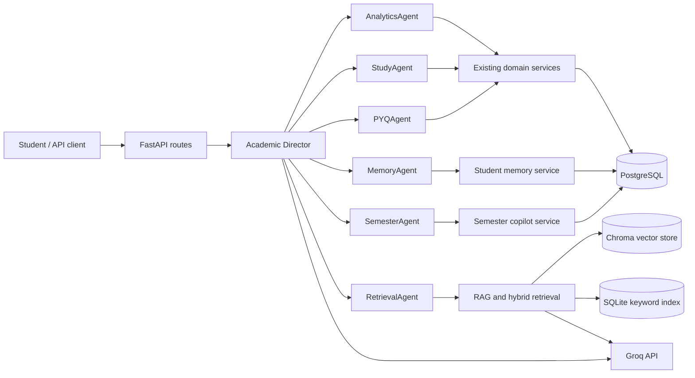

# Jarvis Architecture

## Runtime Topology

## Request Flow

FastAPI routes validate requests and call domain services. The Director classifies a goal, selects an ordered plan, resolves agents through `app/agents/agent_registry.py`, and passes shared student, DB-session, goal, and optional subject/retrieval context. Agents wrap existing analytics, planning, PYQ, retrieval, memory, and semester services and return a standard response envelope. The Director isolates individual failures, combines readiness/plans/PYQ/milestone/risk data, and generates a unified strategy with a deterministic fallback if Groq is unavailable.

## Persistence

- PostgreSQL stores students, courses, subjects, materials, questions, plans, analytics, profiles, memories, readiness snapshots, semesters, enrollments, and milestones.
- Alembic owns schema changes; current head is `f2c8a4d1b709`.
- Chroma stores document vectors. Local mode uses `PersistentClient`; `CHROMA_HOST`, `CHROMA_PORT`, and `CHROMA_SSL` select `HttpClient` for deployments.
- BM25 metadata is maintained by the keyword-search service in SQLite.
- Compose persists PostgreSQL, Chroma, uploads, and model cache in named volumes.

## Operational Boundaries

The system health route checks DB connectivity, Chroma connectivity, Groq key configuration, and migration state. It does not call Groq. `scripts/validate_system.py` also verifies tables, indexes, foreign keys, orphan references, registry, and routes. Authentication/authorization is not implemented; protect deployment behind an authenticated gateway until that work is complete.