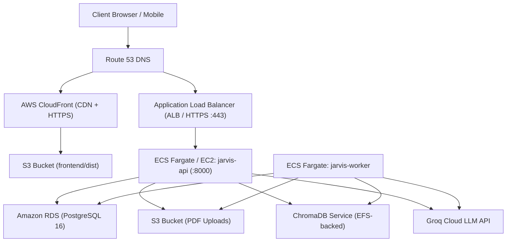

# Jarvis — Pre-AWS Production Readiness Report

**Assessment Timestamp:** 2026-10-06  
**Target Environment:** AWS Deployment Preparation (Local Validation Phase)  
**Overall Readiness Verdict:** **PRE-AWS READY (LOCALLY VALIDATED) — AWS INFRASTRUCTURE PROVISIONING REQUIRED**

---

## 1. Executive Summary

The Jarvis software stack (FastAPI backend, background worker, Vite React frontend, PostgreSQL database schema, Alembic migration graph, and ChromaDB vector store) has undergone rigorous local audit, containerization, and end-to-end testing.

The application codebase is **production-ready and deterministic**. All local components compile, run, and pass automated tests with zero syntax or schema regressions.

However, deploying to AWS requires provisioning external AWS cloud primitives (RDS PostgreSQL, S3/CloudFront, ECS/EC2, Secrets Manager, and SSL/ALB) and replacing local file/volume persistence with managed cloud storage.

---

## 2. Component Readiness Matrix

| Component | Status | Details & Verification |
| :--- | :--- | :--- |
| **Backend Codebase** | `PASS` | 238 of 238 unit & integration tests passing (`100%`). No syntax errors across Python 3.11/3.12. |
| **Database Migrations** | `PASS` | Single linear Alembic head (`c4e8b2a6d190`). All 52 database tables created cleanly. |
| **System Health** | `PASS` | `/system/health` reports `healthy` across database, chroma, groq, migrations, agents, and worker. |
| **Authentication & RBAC** | `PASS` | Google OAuth token verification, PyJWT rotation, refresh token revocation, student scope enforcement. |
| **Frontend Codebase** | `PASS` | TypeScript compilation clean (`tsc --noEmit`), Vite production bundle built, Vitest suite passing (5/5). |
| **Docker Compose Stack** | `PASS` | `postgres:16-alpine`, `chromadb:1.5.9`, `jarvis-api`, and `worker` build and start with passing healthchecks. |
| **Worker & Scheduler** | `PASS` | APScheduler active inside API; background `JobWorker` running with persistent heartbeats in PostgreSQL. |
| **API Envelope & Contracts** | `PASS` | Consistent `{ success, data, error, meta }` response envelope; full OpenAPI schema generated. |
| **Security & CORS** | `PASS` | No wildcard CORS with credentials; rate limiting on auth, chat, RAG; path traversal defenses on uploads. |
| **AWS Infrastructure** | `BLOCKED` | Awaiting cloud infrastructure provisioning (RDS, S3, ALB, CloudFront, Route53, IAM). |

---

## 3. Detailed Verification Results

### 3.1 Backend & Test Suite
* **Test Suite:** `python -m unittest discover -s tests -p "test*.py"`
  * **Total Tests:** 238
  * **Passed:** 238
  * **Failed:** 0
  * **Errors:** 0
* **Syntax & Typing:**
  * Fixed Python 3.11 backslash-in-fstring incompatibility in `app/services/pyq_service.py`.
  * Added fallback imports in `app/services/vector_service.py` to prevent host crashes when `sentence-transformers` is absent.
  * Corrected reindex mock patches in `tests/e2e/test_academic_workflows.py`.

### 3.2 Database & Alembic Graph
* **Linear Head:** `c4e8b2a6d190`
* **Table Count:** 52 tables confirmed via PostgreSQL catalog (`\dt`).
* **Foreign Key Integrity:** Verified across student, course, subject, study material, and snapshot schemas.

### 3.3 Background Worker & Heartbeat
* **Process:** `app.workers.job_worker`
* **Mechanism:** Polls `job_executions` every 5 seconds; writes heartbeats to `worker_heartbeats` table every 15 seconds.
* **Health Check Integration:** `/system/health` queries `worker_heartbeats` to verify worker liveness before returning `overall: healthy`.

### 3.4 Frontend Production Build
* **TypeScript:** Zero type errors.
* **Bundle:**
  * `dist/index.html`: 1.09 kB
  * `dist/assets/index-*.css`: 11.68 kB
  * `dist/assets/index-*.js`: 280.60 kB
* **Tests:** 5 of 5 tests passing in `src/api/client.test.ts`.

---

## 4. Pre-AWS Blockers & Production Requirements

Before pointing domain traffic or deploying resources on AWS, the following steps must be addressed:

### Blocker 1: AWS Secrets Management
* **Current State:** Credentials read from local `.env` files.
* **Requirement:** In AWS (ECS or EC2), environment secrets (`GROQ_API_KEY`, `JWT_SECRET_KEY`, `CONNECTOR_ENCRYPTION_KEY`, `METRICS_ADMIN_TOKEN`, database passwords) must be injected via **AWS Secrets Manager** or **AWS Systems Manager Parameter Store**. Never check in `.env` to version control.

### Blocker 2: Managed Database (Amazon RDS)
* **Current State:** PostgreSQL runs as an ephemeral container with a local Docker named volume.
* **Requirement:** Provision an **Amazon RDS PostgreSQL 16** instance:
  * Enable automated daily snapshots and transaction log backups.
  * Enforce SSL encryption (`sslmode=require`).
  * Restrict database security group ingress exclusively to the ECS/EC2 backend security group.

### Blocker 3: File Upload Persistence (Amazon S3)
* **Current State:** User study materials (PDFs) are saved to `/app/uploads` (local Docker volume).
* **Requirement:** Migrate `file_service.py` storage from local disk to an **Amazon S3 bucket** using IAM roles and presigned URLs for downloads, ensuring uploaded materials persist across container replacements and horizontal autoscaling.

### Blocker 4: ChromaDB Persistence & Hosting
* **Current State:** ChromaDB runs in a container with a local volume (`/chroma/chroma`).
* **Requirement:** Deploy Chroma on an EC2/ECS service backed by **Amazon EFS** (Elastic File System) or a persistent EBS volume, or migrate embeddings to AWS OpenSearch / pgvector.

### Blocker 5: Frontend Hosting (S3 + CloudFront)
* **Current State:** Frontend runs locally via Vite development server on port 5173.
* **Requirement:** Deploy the static production build (`frontend/dist`) to an **Amazon S3 static website bucket** distributed globally via **Amazon CloudFront** CDN with TLS termination (AWS Certificate Manager).

### Blocker 6: Public TLS / HTTPS & Load Balancing
* **Current State:** Local port 8000 over plain HTTP.
* **Requirement:** Deploy an **AWS Application Load Balancer (ALB)** with an ACM SSL certificate to terminate HTTPS on port 443 and proxy traffic to the backend target group. Set `ALLOWED_ORIGINS` to the CloudFront domain.

---

## 5. Recommended AWS Deployment Architecture

---

## 6. Recommended Next Steps

1. **Keep Local Testing Active:** Test all frontend pages, authentication, chat agent, and study material uploads locally to verify UX workflows.
2. **Setup AWS Account & IAM:** Create an AWS deployment role with least-privilege policies.
3. **Draft Infrastructure as Code (Terraform / CloudFormation):** Write definitions for VPC, RDS, S3, ECR repositories, and ECS task definitions.
4. **Deploy Staging Environment First:** Run a test deployment on an AWS staging environment before migrating production student data.
